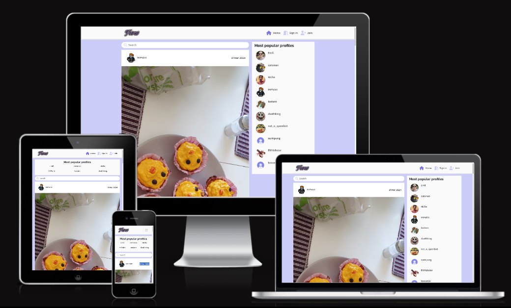
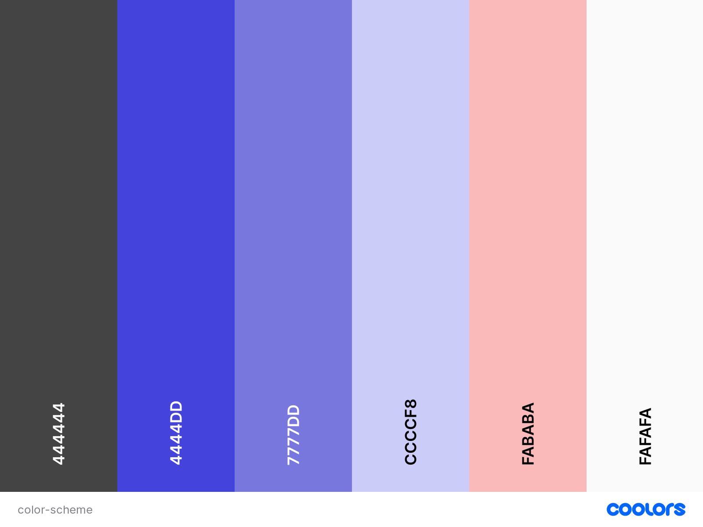
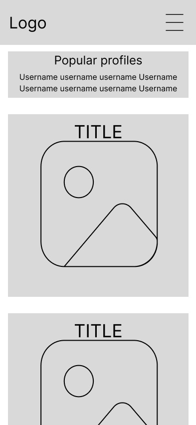
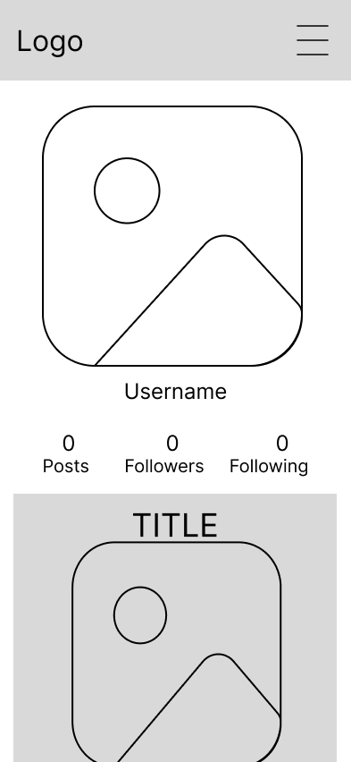
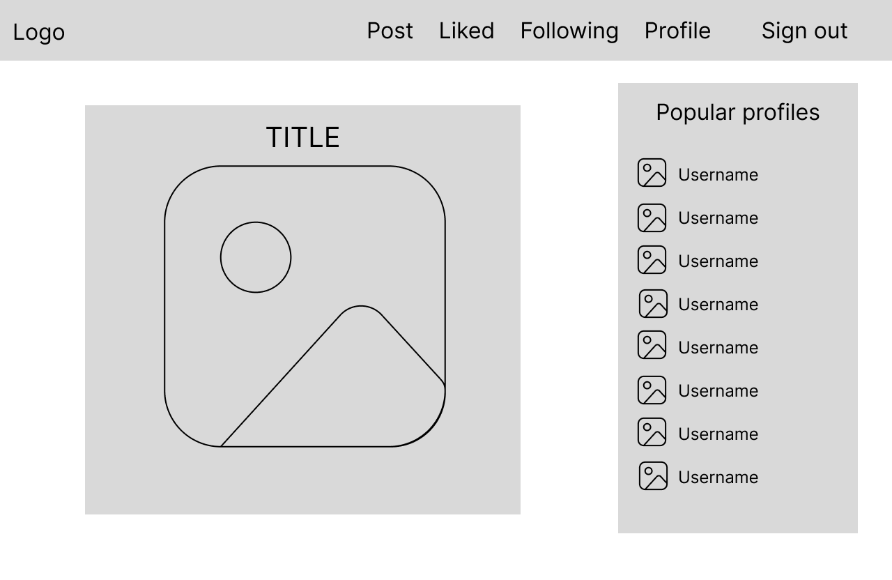
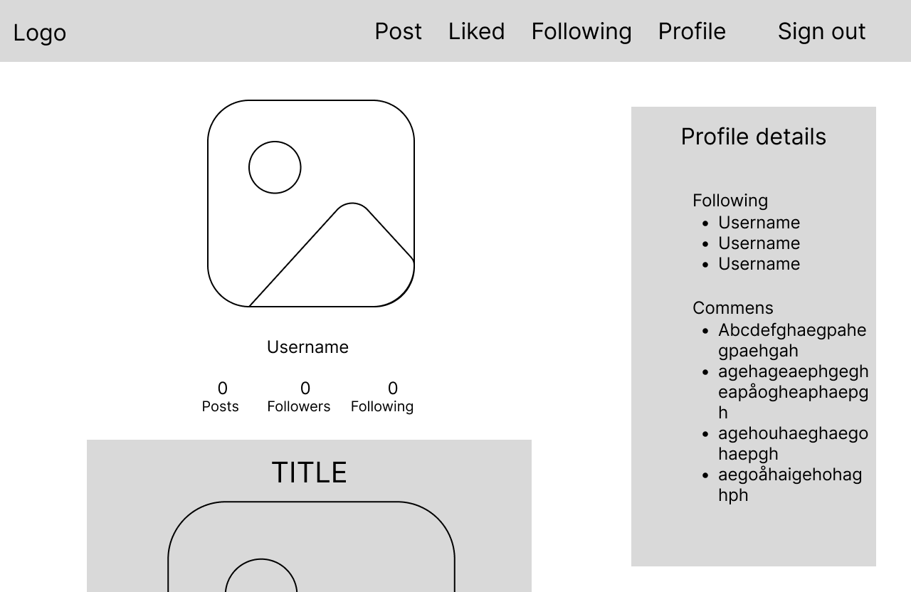

Flow is an image-sharing social media site. Users can post images, comment on posts, and follow other users.
Users can also create personal feeds by following other users and liking posts. They can also hide unwanted content, block users, create their own inner circle of selected followers, and more.

[View the website here](https://fooroom-9cc630806337.herokuapp.com/)

## Contents

* [Features](#Features)
  * [Existing Features](#existing-features)
    * [General Features](#general-features)
    * [Navigation Bar](#navigation-bar)
    * [Profiles Sidebar](#profiles-sidebar)
    * [Post List](#post-list)
    * [Post Page](#post-page)
    * [Profile Page](#profile-page)
    * [Register/Login page](#registerlogin-page)
    * [Post Report](#post-report)
  * [Future Implementations](#future-implementations)
  * [Defensive Design Feaures](#defensive-design-features)

* [User Experience](#User-Experience)
  * [User Stories](#User-Stories)

* [Design](#Design)
  * [Color Scheme](#color-scheme)
  * [Wireframes](#wireframes)
  * [Accessibility](#Accessibility)
  * [Agile Methodology](#agile-methodology)
  * [Data Model](#data-model)

* [Technologies Used](#Technologies-Used)
  * [Languages Used](#Languages-Used)
  * [Frameworks, Libraries & Programs Used](#frameworks--libraries-used)
  * [Other Technologies Used](#other-technologies-used)

* [Deployment](#Deployment)
  * [Heroku](#heroku)
  * [GitHub](#github)

* [Testing](#Testing)
  * [Solved Bugs](#solved-bugs)
  * [Unfixed Bugs](#unfixed-bugs)
  
* [Credits](#Credits)
  * [Media](#Media)
  * [Tutorials & Code Used](#tutorials--code-used)

## Features

### Existing Features

#### General Features


* Fully responsive design
* Full frontend CRUD for user content and profiles 
* Custom toast notification system
* Advanced user interaction options
* Redirection of users based on authorization

#### Navigation Bar:


The navigation is omnipresent across the site and displays a different set of links depending on whether or not the user is signed in. The layout and content are responsive and adapt to the screen size.

#### Profiles Sidebar:


Users can see a list of the most popular profiles in a dedicated sidebar. It lists the profiles with the most followers. Users can acess these profiles from the sidebar, and signed-in users can follow or unfollow them directly from the sidebar.

The profile sidebar is always present on screens that are big enough. On smaller screens, it instead appears in the form of a smaller section above the main content, and on certain pages it is removed.

#### Post List:


The main page of the app lets the user browse all posts in an infinite scroll format. A simple search bar enables filtering by page titles and usernames in real-time. Clicking a post opens the post page for that particular post.

Signed-in users also have access to a filtered feed of the users they follow, and one for only the posts they have liked. If the user has blocked another user, their posts will not appear in the post list. Any post that is set to "friends only" visibility only appears in the post list if its owner has marked you as a friend.

#### Post Page:


On the post page, users can see the details of a specific post. They can also see a feed of user comments for the post. Comments appear in an infinite scroll format.

Signed-in users can also edit or delete any post they own from its post page.

#### Profile Page:


The profile page displays information about the associated user. For example, you can see how many posts they've made, how many followers they have, and how many profiles they're following. If the user is your follower, you see a line about that as well. There's also an information section where the user can add their own information.

Next to this section, a signed-in user can see buttons for following and blocking the profile owner, unless the profile belongs to the signed-in user. If the profile owner is a follower of the signed-in user, there's also a button for marking the profile owner as a friend.

Below the main profile section, you can see all posts made by the profile owner.

#### Register/Login Page:


The register page lets user create a new user without any hassle. Upon registration, the user is redirected to the sign-in page. If a signed-in user somehow navigates to either of these pages, they are redirected to the home page.

#### Post Report


Signed-in users can see a "report" button on posts in the post list and on the post page. Clicking the button opens a report form where they can state the reason for reporting the post. When a report is submitted, it appears on the admin page to let admins quickly find potentially illicit/offensive content.

### Future Implementations:

Future iterations of the project will include more user pages. Users will have access to lists of friends, comments, and blocked users. Profile pages will include more information as well. Blocking a user will also have more extensive effects beyond simply hiding content.

### Defensive Design Features

* Authorization checks
  * There are multiple layers of authorization, using JWT tokens and CORS headers to grant access to the selected client
  * The app checks for auth status wherever it's relevant
  * Unauthorized users are redirected away from pages that require authorization
  * Sensitive operations check the authorized user's owner status
  * The app always checks for auth status before trying to access anything related to user data

* Form validation
  * Submitted data is validated on both the frontend and the backend
  * Any invalid data sent to the backend is rejected and throws an error
  * Image file size is restricted using a custom validator
  * Model fields that can be manipulated have default values and restrictions such as maximum character count

* Backup and default values
  * Profile images have a default value to prevent broken image elements
  * Profiles are automatically created when users are created, to prevent any risk of null references

* Error pages
  * A "page not found" appears whenever a user tries to access an invalid URL

## User Experience

### User stories

EPIC - Navigation
* Navigation bar: As a user I can see a navigation menu on every page so that I can navigate with ease
* Routing: As a user I can navigate easily through pages so that I can browse the site without reloading the page

EPIC - Authentication
* Sign in: As a registered user I can sign in to the app so that I can use my account
* Authentication status: As a user I can see whether or not I am signed in so that I can sign in or out as needed
* Stay logged in: As a user I can stay logged-in until I choose to log out so that I can have a smooth experience

EPIC - Posting
* Create post: As a signed-in user I can create new posts so that I can show my images to other users
* Edit post: As a post owner I can edit the details of my post so that I can update posts or fix mistakes
* Delete post: As a post owner I can delete my post so that I have control over my content

EPIC - Browsing
* View recent posts: As a user I can view all the most recent posts, ordered by most recently created first so that I am up to date with the newest content
* Personal feed: As a user, I can choose to view only the content I choose to follow, so that I can find the most relevant content for me
* Search posts: As a user, I can search for specific posts, so that I can find the content that I seek
* View post details: As a user I can open a single post so that I can see its details and comments
* Infinite scroll: As a user I can keep scrolling down the page to load more posts automatically so that I have a smooth experience

EPIC - Comments
* View comments: As a user I can view comments on posts so that I can read other users' thoughts about the post
* Create a comment: As a signed-in user I can add my own comments to posts so that I can share what I think and feel about posts
* Delete comments: As the owner of a comment I can delete the comment so that I can remove comments I no longer want to share
* Edit a comment: As the owner of a comment I can edit the comment so that I can update comments and fix errors

EPIC - Like Posts
* Like posts: As a signed-in user I can like posts so that I can show my what content I like
* Unlike posts: As a signed-in user I can unlike a liked post so that I can change my mind
* View liked posts: As a signed-in user I can view a feed of only my liked posts so that I can look at my favorite content

EPIC - Follow Users
* Follow users: As a signed-in user I can follow users so that I can support users who post interesting content
* View followed user posts: As a signed-in user I can view a feed of only posts by users I follow so that I can see what they're posting
* Unfollow users: As a signed-in user I can unfollow my followed users so that I can remove their posts from my feed

EPIC - User Profile
* Profile page: As a user I can view the profiles of other users so that I can see their content and profile information
* Most popular profiles: As a user I can see a list of the users with the most followers so that I can see what's popular
* User stats: As a user I can see the number of posts, follows and followed users of any profile so that I can learn more about the users
* View user's posts: As a user I can view all of a user's posts from their profile page so that I can find their content and see whether I should follow them
* Edit profile: As a signed-in user I can edit my profile so that I can update my avatar and profile information
* Update username and password: As a signed-in user I can change my username and password so that I have control over my account

EPIC - Block Unwanted Content
* Block user: As a signed-in user I can block another user so that I do not have to see their posts
* Report content: As a signed-in user I can report a post so that inappropriate content can be moderated

EPIC - Friends
* Add friend: As an authenticated user I can add followers to a list of friends so that I can have an inner circle of selected followers
* Friends only: As an authenticated user I can restrict the visibility of my post so that only followers on my friends list can see it

## Design

### Color Scheme



I went with a mellow blue color scheme for the app design. I wanted something that's subtle and consistent but still more interesting than grayscale.

### Wireframes

<details>
<summary>Wireframes</summary>






</details>

### Accessibility

To help with accessibility, I have made use of aria features such as aria-label and aria-hidden to help screen readers give correct information. I have also used icons for most user interactions to make it easier for users who struggle with reading.

### Agile Methodology


### Data Model


## Technologies Used

### Languages Used

Python, HTML, CSS, and JavaScript.

### Frameworks & Libraries Used

Django REST - The framework used for building the backend API

React - The main framework, used for building the frontend application

Bootstrap - Used for more efficient styling and scripting

FontAwesome - Supplies the icons used across the site

Google Fonts - Supplies the webfont used

### Other Technologies Used

VSCode - Used for all the coding.

Git - For version control.

GitHub - For project management and storage

Heroku - For live site deployment

AWS - Hosting the database

Cloudinary - Hosting the profile images

Google & Mozilla Developer Tools - For debugging and trying out design improvements on the fly.

GNU Image Manipulation Program - Cropping and scaling images for faster load times.

Figma - Wireframing

Lucidchart - ERD design

Multi Device Webiste Mockup Generator - For testing how the site looks on different devices.

WAVE Evaluation Tool - To check accessibility.

Web Disability Simulator - To check accessibility.

realfavicongenerator.net/ - For the Favicon

## Deployment

### Heroku

To deploy the project to Heroku, I took the following steps.

__Requirements and Procfile__

In order to deploy the project, Heroku needs information about the technologies used. Before deployment, I create a Procfile and a list of requirements. In some cases, you may also need a runtime.txt file specifying the version of Python to use.

* Create a plain file called Procfile without any file suffix, at the root level of the project.
* Type ```web: gunicorn fooroom.wsgi:application``` into the Procfile and save.
* In your IDE terminal, type ```pip3 freeze local > requirements.txt``` to create the requirements.
* (Optional) Create a runtime.txt and type ```python-3.12.1``` (or whichever version you use)
* Commit and push these files to the project repository.

__Create the Heroku app:__

* Sign in or sign up to [Heroku](https://heroku.com/).
* Click the button that says "Create new app."
* Enter a unique app name.
* Choose your region from the dropdown menu.
* Click the "Create app" button.

__Heroku Settings:__

For Heroku to be able to process and render the project, you must define some environment variables.
Deploying the project without these is like trying to start a car without the key.

* Go to the settings page of your new app
* Scroll down and open the Config Vars
* Add a DATABASE_URL variable and assign it a link to your database
* Add a SECRET_KEY variable and assign it a secret key of your choice
* Add a CLOUDINARY_URL variable and assign it a link to your Cloudinary

__Project Settings:__

It's important that the environment variables and settings in the django project are compatible with the settings on heroku. These are the steps to ensure a proper setup.

* Include ```https://<your_app_name>.herokuapp.com``` in the ALLOWED_HOSTS and CSRF_TRUSTED_ORIGINS lists inside the settings.py file.
* Make sure that the environment variables (DATABASE_URL, SECRET_KEY, and CLOUDINARY_URL) are correctly set to ```os.environ.get("<variable_name>")```
* If making changes to static files or apps, make sure to run collectstatic or migrate as needed.
* Commit and push to the repository.

__Connect the repository__

Once your Heroku settings and GitHub repository are up to date, it's time to connect the two.

* Go to the Deploy tab of your Heroku app.
* Find the "Deployment method" section and click GitHub.
* Type in the name of your repository to search for it
* Click 'Connect' to connect the repository
* (Optional) Enable automatic deployment to automatically update the Heroku app whenever you push to GitHub

__Deploy the project to Heroku__

Now, all that's left to do is to deploy and open the app.

* Click "Deploy branch"
* Wait for Heroku to finish building the app.
* Upon successful deployment, click the "View" button to open the app.

### GitHub

__How to Fork the Repository__

1. Log in (or sign up) to GitHub.
2. Go to the repository for this project, [EmilionR/django-pp4](https://github.com/EmilionR/django-pp4)
3. Click the Fork button in the top right corner.

__How to Clone the Repository__

1. Log in (or sign up) to GitHub.
2. Go to the repository for this project, [EmilionR/django-pp4](https://github.com/EmilionR/django-pp4)
3. Click on the code button, select whether you would like to clone with HTTPS, SSH or GitHub CLI and copy the link shown.
4. Open the terminal in your code editor and change the current working directory to the location you want to use for the cloned directory.
5. Type 'git clone' into the terminal and then paste the link you copied in step 3. Press enter.

## Testing

Please refer to [TESTING.md](TESTING.md) for full testing documentation.

### Solved Bugs


### Unfixed Bugs


## Credits


### Media


### Tutorials & Code Used

Code Institute Advanced Frontend course
