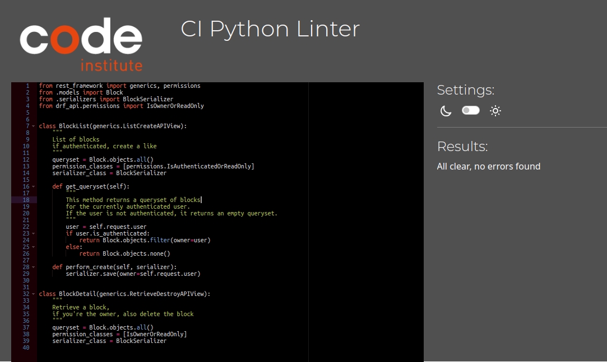

# Table of Contents
* [User Story Testing](#user-story-testing)
* [Validator Testing](#validator-testing)
  * [Python](#python)
  * [JSX](#jsx)
  * [HTML](#html)
  * [CSS](#css)
  * [Lighthouse](#lighthouse)
  * [Custom Automated Testing](#custom-automated-testing)
* [Manual Testing](#manual-testing)
  * [Site Navigation](#site-navigation)
  * [Home Page](#home-page)
  * [Post Detail](#post-detail)
    * [Comment Form](#comment-form)
    * [Comments](#comments)
  * [Post Form](#post-form)
  * [Profile Page](#profile-page)
  * [Sign In/Up Pages](#sign-inup-pages)

[Back to README](README.md)

## User Story Testing

### EPIC | User Profile

__EPIC - Navigation__

| Goals | How are they achieved? |
| --- | --- |
| As a user I can see a navigation menu on every page so that I can navigate with ease | The navigation bar is omnipresent |
| As a user I can navigate easily through pages so that I can browse the site without reloading the page | All navigation links open compoents without refreshing the browser |

__EPIC - Authentication__

| Goals | How are they achieved? |
| --- | --- |
| As a user I can create an account so that I can access member-only features | Users can create accounts |
| As a registered user I can sign in to the app so that I can use my account | Users can sign in to their accounts |
| As a user I can see whether or not I am signed in so that I can sign in or out as needed | The navbar displays different links for authenticated users |
| As a user I can stay logged-in until I choose to log out so that I can have a smooth experience | Auth tokens refresh automatically to keep the user signed in |

__EPIC - Posting__

| Goals | How are they achieved? |
| --- | --- |
| As a signed-in user I can create new posts so that I can show my images to other users | The post create form lets users create new posts |
| As a post owner I can edit the details of my post so that I can update posts or fix mistakes | There's an edit feature on each pos, acccessible to its owner |
| As a post owner I can delete my post so that I have control over my content | Post owners have a 'delete' button on their posts |

__EPIC - Browsing__

| Goals | How are they achieved? |
| --- | --- |
| As a user I can view all the most recent posts, ordered by most recently created first so that I am up to date with the newest content | Posts appear in the food sorted by time of creation in descending order |
| As a user, I can choose to view only the content I choose to follow, so that I can find the most relevant content for me | There's a filtered feed only containing the posts of followed users |
| As a user, I can search for specific posts, so that I can find the content that I seek | The search bar filters posts based on search queries |
| As a user I can open a single post so that I can see its details and comments | Clicking a post opens its detail page |
| As a user I can keep scrolling down the page to load more posts automatically so that I have a smooth experience | New posts are loaded as the user scrolls down |

__EPIC - Comments__

| Goals | How are they achieved? |
| --- | --- |
| As a user I can view comments on posts so that I can read other users' thoughts about the post | Comments appear under the associated post |
| As a signed-in user I can add my own comments to posts so that I can share what I think and feel about posts | The post form appears at the top of the comments section and allows posting of new comments |
| As the owner of a comment I can delete the comment so that I can remove comments I no longer want to share | Comments have a delete button accessible to the comment owner |
| As the owner of a comment I can edit the comment so that I can update comments and fix errors | Comments have an editing form accessible to the comment owner |

__EPIC - Like Posts__

| Goals | How are they achieved? |
| --- | --- |
| As a signed-in user I can like posts so that I can show my what content I like | Each post has a like button with a likes count display |
| As a signed-in user I can unlike a liked post so that I can change my mind | Clicking the like button again removes the like |
| As a signed-in user I can view a feed of only my liked posts so that I can look at my favorite content | There's a special feed for liekd posts |

__EPIC - Follow Users__

| Goals | How are they achieved? |
| --- | --- |
| As a signed-in user I can follow users so that I can support users who post interesting content | Each profile has a follow button visible to signed-in users |
| As a signed-in user I can view a feed of only posts by users I follow so that I can see what they're posting | There's a special feed for posts by followed users |
| As a signed-in user I can unfollow my followed users so that I can remove their posts from my feed | When following a user, the follow button becomes an unfollow button |

__EPIC - User Profile__

| Goals | How are they achieved? |
| --- | --- |
| As a user I can view the profiles of other users so that I can see their content and profile information | Each profile has a public profile page |
| As a user I can see a list of the users with the most followers so that I can see what's popular | A 'popular profiles' section appears on the page |
| As a user I can see the number of posts, follows and followed users of any profile so that I can learn more about the users | Each profile has counters for posts, follows, and followers |
| As a user I can view all of a user's posts from their profile page so that I can find their content and see whether I should follow them | All posts by the profile owner appear on the profile page |
| As a signed-in user I can edit my profile so that I can update my avatar and profile information | An edit form is available to the profile owner |
| As a signed-in user I can change my username and password so that I have control over my account | Menu options for editing the username and password appear to the profile owner |

__EPIC - Block Unwanted Content__

| Goals | How are they achieved? |
| --- | --- |
| As a signed-in user I can block another user so that I do not have to see their posts | Users can block other users from their profile pages |
| As a signed-in user I can report a post so that inappropriate content can be moderated | Each post by other users has a report button available to a signed-in user |

__EPIC - Friends__

| Goals | How are they achieved? |
| --- | --- |
| As an authenticated user I can add followers to a list of friends so that I can have an inner circle of selected followers | A friend button is available on the profile pages of followers |
| As an authenticated user I can restrict the visibility of my post so that only followers on my friends list can see it | Setting a post to "friends only" in the posting form makes it visible only to the post owner and their friends |

## Validator Testing

### Python

All Python files were run validated with pep8 and cleaned until no errors were found.

Python validation results

### JSX

I have used jsx-Prettier and ESLint throughout the development to check that my JSX and JavaScript meet the standards for clean code.

### HTML

I validated my HTML pages using the W3 Nu HTML Checker. They came back with no errors, only pointers about redundant trailing slashes left by React. You can check the results for each page below.

HTML validation results

[Post List](https://validator.w3.org/nu/?doc=https%3A%2F%2Femil-pp5-frontend-9557540625e4.herokuapp.com%2F)

[Post Page](https://validator.w3.org/nu/?doc=https%3A%2F%2Femil-pp5-frontend-9557540625e4.herokuapp.com%2Fposts%2F8)

[Profile](https://validator.w3.org/nu/?doc=https%3A%2F%2Femil-pp5-frontend-9557540625e4.herokuapp.com%2Fprofiles%2F1)

[Signup page](https://validator.w3.org/nu/?doc=https%3A%2F%2Femil-pp5-frontend-9557540625e4.herokuapp.com%2Fsignup)

[Login](https://validator.w3.org/nu/?doc=https%3A%2F%2Femil-pp5-frontend-9557540625e4.herokuapp.com%2Fsignin)

[Post Form](https://validator.w3.org/nu/?doc=https%3A%2F%2Femil-pp5-frontend-9557540625e4.herokuapp.com%2Fposts%2Fcreate)

### CSS

I validated my CSS with the Jigsaw CSS validator. All pages come back clean without any errors.

CSS validation results

[Post List](https://jigsaw.w3.org/css-validator/validator?uri=https%3A%2F%2Femil-pp5-frontend-9557540625e4.herokuapp.com%2F&profile=css3svg&usermedium=all&warning=1&vextwarning)

[Post Page](https://jigsaw.w3.org/css-validator/validator?uri=https%3A%2F%2Femil-pp5-frontend-9557540625e4.herokuapp.com%2Fposts%2F8&profile=css3svg&usermedium=all&warning=1&vextwarning)

[Profile Page](https://jigsaw.w3.org/css-validator/validator?uri=https%3A%2F%2Femil-pp5-frontend-9557540625e4.herokuapp.com%2Fprofiles%2F1&profile=css3svg&usermedium=all&warning=1&vextwarning)

[Signup Page](https://jigsaw.w3.org/css-validator/validator?uri=https%3A%2F%2Femil-pp5-frontend-9557540625e4.herokuapp.com%2Fsignup&profile=css3svg&usermedium=all&warning=1&vextwarning)

[Login](https://jigsaw.w3.org/css-validator/validator?uri=https%3A%2F%2Femil-pp5-frontend-9557540625e4.herokuapp.com%2Fsignin&profile=css3svg&usermedium=all&warning=1&vextwarning)

[Post form](https://jigsaw.w3.org/css-validator/validator?uri=https%3A%2F%2Femil-pp5-frontend-9557540625e4.herokuapp.com%2Fposts%2Fcreate&profile=css3svg&usermedium=all&warning=1&vextwarning)

### Lighthouse

I used Lighthouse to test all pages. Performance results were quite low, but this is to be expected when loading multiple images from an API, and sending lots of requests to another API. All other scores are good. 

#### Desktop

| Page         | Performance | Accessibility | Best Practices | SEO |
|--------------|-------------|---------------|----------------|-----|
| Home         |          56 |            94 |             96 | 100 |
| Post Detail  |          64 |            93 |             96 | 100 |
| Post Form    |          93 |            94 |            100 | 100 |
| Profile page |          84 |            91 |             96 |  91 |
| Login        |          91 |            92 |             96 | 100 |
| Register     |          90 |            92 |             96 | 100 |

#### Mobile

| Page         | Performance | Accessibility | Best Practices | SEO |
|--------------|-------------|---------------|----------------|-----|
| Home         |          16 |            94 |             96 | 100 |
| Post Detail  |          16 |            94 |             96 | 100 |
| Post Form    |          50 |            94 |             96 | 100 |
| Profile page |          42 |            91 |             93 |  92 |
| Login        |          51 |            94 |             96 | 100 |
| Register     |          50 |            94 |             96 | 100 |

### Custom Automated Testing

In addition to the various validators and automated tests above, I created some automated tests to test my code. Most of these tests check models, serializers, and validators used on the backend.

## Manual Testing

__Browser Testing__

I have tested this site on the following browsers:

* Google Chrome
* Mozilla Firefox
* Brave
* Safari
* Microsoft Edge
* Android Internet

__Device Testing__

* Lenovo Thinkpad t480
* Samsung Galaxy S23
* Samsung Galaxy S22
* Samsung Galaxy S9

### Site Navigation

| Feature | Action | Expected Outcome | Pass/Fail |
| --- | --- | --- | --- |
| Navbar Logo | Hover/Focus | Indicate focus | Pass |
| Navbar Logo | Click | Redirect to home | Pass |
| Navbar toggler | Display | Visible on small screens only | Pass |
| Navbar toggler | Click | Opens dropdown with navigation links | Pass |
| Following Link | Display | Only display when user is signed in | Pass |
| Following Link | Click | Open following feed page | Pass |
| Liked Link | Display | Only display when user is signed in | Pass |
| Liked Link | Click | Open liked posts feed page | Pass |
| Navbar Links | Display | Links display in header on screens above a certain size | Pass |
| Profile Link | Display | Only display when user is signed in | Pass |
| Profile Link | Click | Open profile page | Pass |
| Register Link | Display | Only display when user is not signed in | Pass |
| Register Link | Click | Open signup page | Pass |
| Log-in Link | Display | Only display when user is not signed in | Pass |
| Log-in Link | Click | Open login page | Pass |
| Log-out Link | Display | Only display when user is signed in | Pass |
| Log-out Link | Click | Log the user out | Pass |

### Home Page
| Feature | Action | Expected Outcome | Pass/Fail |
| --- | --- | --- | --- |
| Post list | Display | All posts appear in sorted order | Pass |
| Post | Display | Post displays title, author, image, content, and time of posting | Pass |
| Post | Display | Post displays the number of likes and comments | Pass |
| Avatar | Display | Post owner's avatar is present on the post | Pass |
| Avatar | Click | Clicking an avatar opens the associated profile page | Pass |
| Post Link | Click | Clicking the post opens the detail page | Pass |
| Like Icon | Click | Like/Unlinke the post | Pass |
| Like Counter | Display | Display the correct number of likes received by the post | Pass |
| Comment Icon | Click | Open the post's comment section | Pass |
| Comment Counter | Display | Display the correct number of comments on the post | Pass |
| Search Bar | Input | Apply search term and filter posts automatically | Pass |
| 'New Post' Button | Display | Only visible to signed-in users | Pass |
| 'New Post' Button | Click | Open post form | Pass |
| Post feed | Display | All posts appear in an infinite scroll feed | Pass |
| Post feed | Display | Posts by blocked users are not displayed | Pass |
| Post feed | Display | "Following" feed only displays posts by followed users | Pass |
| Post feed | Display | "Liked" feed only displays posts the current user has liked | Pass |
| Report button | Display | Only displays on other users' posts | Pass |
| Report button | Click | Open the report form | Pass |
| Report form | Submit | Sends a report to the admin page | Pass |

### Post Detail
| Feature | Action | Expected Outcome | Pass/Fail |
| --- | --- | --- | --- |
| Post | Display | Post displays title, author, image, content, and time of posting | Pass |
| Post | Display | Post displays the number of likes and comments | Pass |
| Avatar | Display | Post owner's avatar is present on the post | Pass |
| Avatar | Click | Clicking an avatar opens the associated profile page | Pass |
| Edit Button | Display |  Display if logged in as the author of the post | Pass |
| Edit Button | Click | Open the post editing page | Pass |
| Delete Button | Display |  Display if logged in as the author of the post | Pass |
| Delete Button | Click | Delete the post | Pass |
| Like Icon | Click | Like/Unlinke the post | Pass |
| Like Counter | Display | Display the correct number of likes received by the post | Pass |
| Comment Icon | Click | Open the post's comment section | Pass |
| Comment Counter | Display | Display the correct number of comments on the post | Pass |
| Report button | Display | Only displays on other users' posts | Pass |
| Report button | Click | Open the report form | Pass |
| Report form | Submit | Sends a report to the admin page | Pass |

#### Comments
| Feature | Action | Expected Outcome | Pass/Fail |
| --- | --- | --- | --- |
| Comment Form | Display | Display when a user is signed in | Pass |
| Comment Form | Submit | Submit the form and add the comment to the post | Pass |
| Comments | Display | Commments appear in descending order in an infinite scroll format | Pass |
| Comments | Display | Comments display the owner's username and avatar | Pass |
| Comments | Display | Comments by blocked users are blocked | Pass |
| Comments | Click | Clicking the avatar opens the associated profile | Pass |
| Edit Button | Display |  Display if logged in as the author of the post | Pass |
| Edit Button | Click | Open the comment form | Pass |
| Delete Button | Display |  Display if logged in as the author of the post | Pass |
| Delete Button | Click | Delete the comment | Pass |

### Post Form
| Feature | Action | Expected Outcome | Pass/Fail |
| --- | --- | --- | --- |
| Upload Button | Display | The upload Button appears | Pass |
| Upload Button | Click | Opens a file Belector window | Pass |
| Title Input | Display | The title inIut has a label making its purpose clear | Pass |
| Title Input | Input | The user can type in the Title field | Pass |
| Content Input | Display | The content input has a label making its purpose clear | Pass |
| Contnet Input | Input | The user can type in the content field | Pass |
| "Friends only" Toggle | Display | A checkbox with a label explaining its purpose appears | Pass |
| "Friends only" Toggle | Click | Clicking the checkbox toggles the state | Pass |
| Cancel Button | Click | Close the form without any changes | Pass |
| Submit Button | Click | Submit the form and create/update the post | Pass |
| Submit Button | Click | Close the form and redirect the user to the post feed | Pass |

### Profile Page
| Feature | Action | Expected Outcome | Pass/Fail |
| --- | --- | --- | --- |
| Avatar | Display | The user's avatar appears on the top of the page | Pass |
| Username | Display | The user's username appears on the top of the page | Pass |
| User Stats | Display | The number of posts, followers, and followed users are displayed | Pass |
| "Follows you" Message | Display | If the profile owner follows the signed-in user, a line about it appears | Pass |
| Options Button | Display | The option button appears if signed-in as the profile owner | Pass |
| Options Button | Click | Clicking opens the profile options menu | Pass |
| Options Menu | Display | Display options for editing the profile, username, password, and deleting the account | Pass |
| "Edit profile" Button | Click | Open the profile editing form | Pass |
| "Change username" Button | Click | Open the username editing form | Pass |
| "Change password" Button | Click | Open the password editing form | Pass |
| "Delete account" Button | Click | Opens a delete confirmation modal | Pass |
| Delete Confirmation Modal | Display | Displays a message about permanent deletion and options to confirm or cancel | Pass |
| Delete Confirmation Modal | Effect | Modal prevents interaction with the page until user responds to the modal | Pass |
| Cancel Button | Click | Closes the deltion modal without any action | Pass |
| Delete Button | Click | Deletes the profile and its associated user instance, along with any cookies and auth tokens, then redirects the user | Pass |
| User Posts | Display | The profile owner's posts are displayed under the profile | Pass |
| User Posts | Display | The profile post feed has an infinite scroll layout | Pass |

### Sign In/Up Pages
| Feature | Action | Expected Outcome | Pass/Fail |
| --- | --- | --- | --- |
|  |  |  |  |
|  |  |  |  |

[Back to README](README.md)